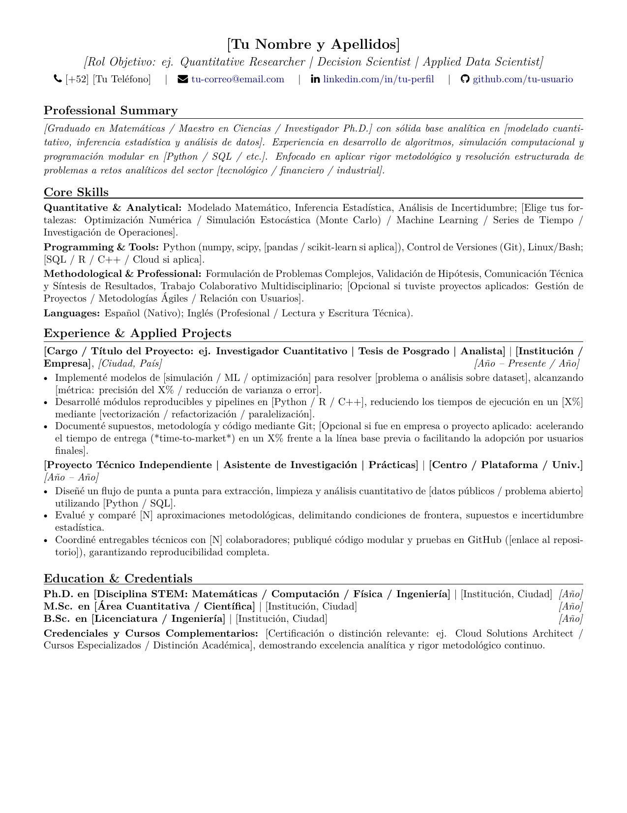

# 📄 Plantilla de CV para Perfiles STEM en Transición a la Industria

> **La regla de oro del CV en la industria:** Un reclutador o líder técnico le dedica entre 15 y 30 segundos a la primera lectura de tu currículum. Si tu documento tiene 5 páginas de artículos indexados y tecnicismos incomprensibles, se descarta. Si en una sola página demuestra **rigor analítico, capacidad de entrega y métricas de impacto**, consigues la llamada de Recursos Humanos.

Esta plantilla condensa el formato y la estructura probados en el sector bancario, fintech y corporativo para perfiles de física, matemáticas e ingenierías.

---

## 👁️ Vista Rápida del Formato Compilado

  

## 📥 Descarga y Uso

* 📄 **[Descargar PDF Compilado (`plantilla-cv.pdf`)](./plantilla-cv.pdf)** — Para ver el render final o usar de referencia visual.
* 🛠️ **[Código Fuente en LaTeX (`plantilla-cv.tex`)](./plantilla-cv.tex)** — Cópialo o ábrelo en [Overleaf](https://www.overleaf.com/) (`pdflatex`) para personalizarlo con tus datos.

*Compatible al 100% con `pdflatex` y cualquier editor estándar de LaTeX.*

---

## 🧭 ¿Cómo ordenar las secciones según tu punto de partida?

No todos transitan en el mismo momento. Adapta el orden según tu situación:

### Caso A: Transición directa desde la academia
*Es el caso más común.* Vienes con el estigma de ser "teórico" o de haber trabajado solo en problemas abstractos.

* **Orden recomendado:**  
  `Summary` ➔ **`Core Skills`** ➔ `Experience & Projects` ➔ `Education`
* **Por qué:** Colocar las habilidades técnicas (Python, SQL, Git, Linux, Estadística) inmediatamente debajo del resumen disipa en 5 segundos la duda del reclutador: demuestra de entrada que eres operativo.

#### Cómo adaptar el bloque de "Experiencia" según tu grado:

| Grado de partida | Nombre recomendado del bloque | Enfoque clave que debes evidenciar |
| :--- | :--- | :--- |
| **Licenciatura (Recién egresado)** | `Applied & Technical Projects` | Foco en repositorios de GitHub, hackathons o prácticas. Demuestra que sabes construir código funcional fuera de un examen. |
| **Maestría (M.Sc.)** | `Quantitative Research & Applied Development` | Vende tu tesis como un proyecto E2E de 1.5–2 años con entregables concretos, manejo de datos y código modular. |
| **Doctorado (Ph.D.)** | `Quantitative Research & Algorithm Development` | Vende el posgrado como 3–5 años de investigación y desarrollo algorítmico independiente. Enfatiza pipelines, optimización numérica y pragmatismo (cero jerga académica abstracta). |
| **Posdoc** | `Postdoctoral Research Fellow / Senior Quant` | Trátalo como rol profesional sénior autónomo. Resalta liderazgo técnico, gestión de proyectos/recursos y mentoría. |

### Caso B: Transición tardía (Años como profesor-investigador titular o con experiencia previa en industria)
Llevas 5, 10 o 15 años en la academia y das el salto, o ya tienes algún puesto corporativo previo.
* **Orden recomendado:**  
  `Summary` ➔ **`Professional Experience`** ➔ `Core Skills` ➔ `Education`
* **Por qué:** Aquí tu mayor activo es el liderazgo de proyectos grandes, presupuestos y mentoría. Agrupa tu etapa académica en un solo bloque sólido (*«Investigación Científica & Cómputo de Alto Rendimiento»*) en lugar de listar nombramientos anuales menores que solo saturan la página.

---

## 🏛️ Anatomía de la Plantilla (Sección por Sección)

### 1. Encabezado Claro y Directo
* **Nombre completo en grande.**
* **Título objetivo (NO tu grado académico aislado):** En lugar de solo poner *"Doctor en Física"*, pon tu rol objetivo:  
  *Ejemplo:* `Quantitative Researcher | Decision Scientist | Applied Data Scientist`.
* **Contacto mínimo:** Teléfono con código de país, correo electrónico sobrio, enlace a LinkedIn y enlace a GitHub.
* ⚠️ **Sin fecha:** Nunca pongas fecha al documento (como `09/2026`). En la industria un CV no se fecha; puede hacer que parezca viejo meses después o confundir a los sistemas ATS.

### 2. Resumen Profesional (*Professional Summary*) — Máximo 3 o 4 líneas
Debe responder tres preguntas de inmediato:
1. ¿Quién eres analíticamente?
2. ¿Qué problemas sabes resolver?
3. ¿Cómo combinas tu rigor con herramientas de producción?

### 3. Habilidades Clave (*Core Skills*)
Divídelas en categorías claras para demostrar equilibrio entre técnica y negocio:
* **Technical & Quantitative:** Modelado estadístico, optimización matemática, series de tiempo, ML supervisado/no supervisado, Python (pandas, numpy, scikit-learn, scipy), SQL, Git, Linux/Bash.
* **Business & Strategy:** Ciencia de decisiones, traducción negocio-técnica, diseño experimental, comunicación ejecutiva a stakeholders, metodologías ágiles.
* **Languages:** Nivel de idiomas profesional.

### 4. Experiencia e Investigación Aplicada (*Experience & Applied Research*)
> 💡 **Nota crucial sobre el impacto:** No crees una sección separada de "Selected Impact" al fondo del CV. Cada viñeta de tu experiencia debe llevar el impacto integrado con la fórmula:  
> **[Verbo de acción] + [Problema / Contexto técnico] + [Resultado o Métrica de impacto]**.

* **Si vienes de academia (Tesis / Posdoc / Cátedra):**
  - *No digas:* "Cálculo de diagramas de Feynman para colisiones de hadrones".
  - *Di:* "Diseñé algoritmos de clasificación señal-ruido sobre datasets de alta dimensionalidad (~PB), optimizando el tiempo de cómputo en clústeres HPC en un 35% mediante paralelización".
  - *Dirección de tesis:* "Mentoría y liderazgo técnico de equipos de posgrado en modelado estadístico, control de versiones (Git) y estándares internacionales de entrega".

### 5. Formación Académica y Credenciales (*Education & Credentials*)
Sé conciso. Grado, institución, ciudad y año de graduación.  
Si tienes certificaciones de industria (BMV, Cloud, etc.) o reconocimientos nacionales (como el SNII), agrégalos aquí explicando qué demuestran: excelencia en resolución de problemas complejos y rigor continuo.

---

## 🚫 Errores Comunes que Debes Evitar (Checklist)

| ❌ Lo que debes evitar | ✅ Lo que debes hacer |
| :--- | :--- |
| Barras de porcentaje de habilidades (*"Python 90%"*). | Mencionar las herramientas en contexto de proyectos reales. |
| Incluir tu lista completa de 20+ artículos científicos. | Sintetizar tu productividad en 1 viñeta de impacto o enlazar a tu Google Scholar / INSPIRE-HEP. |
| Diseños en dos columnas con gráficos que rompen los ATS. | Diseño en una sola columna, tipografía limpia y texto plano legible por máquinas. |
| Currículum de 4 o 5 cuartillas. | **Una sola cuartilla** contundente (máximo 2 si tienes más de 10 años de experiencia mixta). |
| Tecnicismos herméticos de tu subdisciplina. | Términos universales de la industria: optimización, simulación estocástica, clasificación, pipelines. |
| Secciones desconectadas de logros al fondo. | Integrar la métrica y el impacto dentro de cada viñeta laboral. |

---

*Plantilla creada para el repositorio [de-la-academia-a-la-industria](https://github.com/ivheredia/de-la-academia-a-la-industria). Uso libre bajo licencia MIT.*
